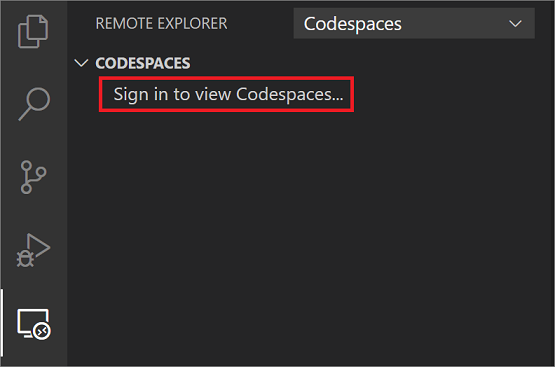

# Visual Studio Online VS Code How-to

## Sign Up

A Microsoft Account and Azure Subscription are required to use Visual Studio Online.

You can sign up for both, as well as receive various Azure incentives at [https://azure.microsoft.com/free/](https://azure.microsoft.com/free/).

<!-- 
- Create Azure Identity
- Create Azure Subscription
-->

## Install

> [!TIP]
> If you don't have [Visual Studio Code](https://code.visualstudio.com/) installed already, you can download it [here](https://code.visualstudio.com/download).

If you'd like to use VS Online from within Visual Studio Code, you'll have to install the VS Online extension. There's two ways to do that:

### Install from Visual Studio Code Marketplace

You can install the [VS Online extension](https://aka.ms/vso-dl) from the [VS Code Marketplace](https://marketplace.visualstudio.com/VSCode) by clicking on the green install button near the top of the page and following the prompts.

<!-- TODO: SCREENSHOT NEEDED -->

### Install from within Visual Studio Code

Alternatively, from within VS Code search for '*Visual Studio Online*' within the **Extensions** side bar, select the extension from the list, and press the **Install** button.

<!-- TODO: SCREENSHOT NEEDED -->

### Post installation

When successfully installed, the **VS ONLINE** panel will be available in the **Remote Explorer** pane.

<!-- TODO: SCREENSHOT NEEDED -->

This panel provides a management interface for interacting with VS Online environments, and is covered in full detail in the remainder of this document.

In addition to the panel, VS Code will also show the remote indicator when the VS Online extension is installed. The remote indicator signals your connection status, and provides a list of available VS Online commands when clicked.

<!-- TODO: SCREENSHOT NEEDED -->

## Sign In

To sign into VS Online, you can either use the **VS Online: Sign In** command in the [command palette](https://code.visualstudio.com/docs/getstarted/userinterface#_command-palette), or by choosing **Sign in to view environments...** in **VS ONLINE** panel of the **Remote Explorer** side bar.

From there, press the **Sign In** button on the notification toast that appears, and follow the prompts in your browser.

<!-- TODO: 
Add content for:
- Filtering Azure Subscription
-->

## Create a Plan

- Create a VSO Plan
  - Subscription
  - Resource Group
  - Region
- Swapping Plan

## Create an environment

### Cloud-hosted

To create a new cloud-hosted environment in VS Online, you can either use the **VS Online: Create New Environment** command in the [command palette](https://code.visualstudio.com/docs/getstarted/userinterface#_command-palette), or by selecting the **Create New Environment** button on the **VS ONLINE** title bar in the **Remote Explorer** side bar.

<!-- TODO: "Create new environment" should be in this screenshot -->

Follow the prompts to provide an environment name, path to Git repository (optional) and auto-suspend settings.

- **Name**: You can name your environment anything you'd like, but we recommend naming it after the project or task that you'll be using it for. (e.g. 'Todo App Environment', 'PR Review', 'Shopping Cart Feature')
- **Git Repository**: If a path to a Git repository is provided, VS Online will automatically clone that repository into the environment. You can specify a Git repository in one of many formats:
  - **Absolute Http(s) Git URL**: A complete Http or Https Url. It may end in a `.git` extension. Examples include:
    - https://github.com/organization/repo.git
    - https://organization@dev.azure.com/organization/repo/_git/repo
    - https://username@bitbucket.org/organization/repo.git
  - **GitHub Project URL**: The Https Url used to navigate to the homepage of a project on GitHub. (e.g. https://github.com/organization/repo)
  - **GitHub Short Form**: The forward slash delimited `organization/repo` format used to refer to projects on GitHub.
  - **GitHub Pull Request URL**: The Https Url used to navigate to a pull request in GitHub. (e.g. https://github.com/organization/repo/pull/123)
- **Auto-suspend Setting**: The length of disconnected time before a VS Online environment will be automatically suspended. Choose between:
  - 5 minutes
  - 30 minutes
  - 2 hours
  - Never auto-suspend the environment. (Manual suspension still available)

> [!TIP]
> The guided environment creation experience described above supports Git repositories over the HTTP(S) scheme. To use another source control provider, or Git over SSH, simply leave the **Git Repository** setting blank, and use the environment's terminal support to clone your source code.

<!-- TODO: Add information about instance type/SKU -->

### Self-hosted

In addition to cloud-hosted environments, you can also "bring your own" self-hosted environments, registering them with VS Online. To do so, first (install VS Code and the VS Online extension)[#install] on the environment you'd like to register. Then use the **VS Online: Register Local Environment** command in the [command palette](https://code.visualstudio.com/docs/getstarted/userinterface#_command-palette).

## Connect to an environment

- From Command Pallet
- From Remote Explorer
- From environment details
- In New Window
- In Browser
- Environment details panel
- Install extension

## Disconnect from an environment

- From Command Pallet
- From Remote Explorer

## Pause an environment

- From Command Pallet
- From Remote Explorer
- Implications of Pausing

## Delete an environment

- From Command Pallet
- From Remote Explorer

## Using the Terminal

- Not local, concept
- Dotfiles integration

## Port Forwarding

- From Command Pallet
- From Remote Explorer
- Auto forward from terminal output
- Disable forwaring a port
- Get Port URL

## Configuration and Settings

- Extension Config
  - Dotfiles
- devContainer.json
  - placement
  - link to reference doc
- Dockerfile
  - placement
  - link to reference doc
